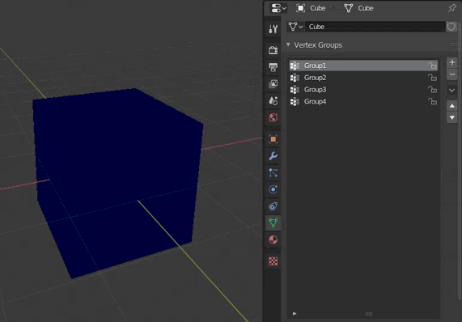
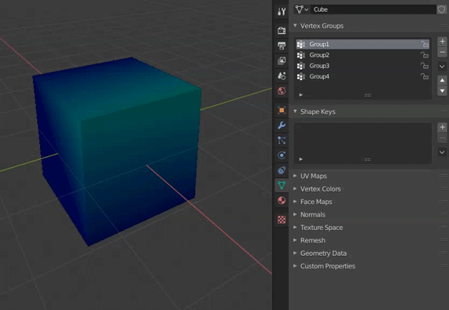

# Blender Scripts

These are a couple scripts I use to help with model ripping.

To install these, download each individual .py file and install as a Blender addon.

# Remove Empty Vertex Groups

Removes all vertex groups that have 0 weights assigned. No tolerance, must have nothing assigned. Prints removed vertex groups to the console.

# Merge Vertex Groups

Think of it like Photoshop's "Merge Down" for image layers. This adds two Vgroup layers together. You can easily modify this for other operations, such as subtracting two vertex groups by modifying the source file in the "mergeGroups" method.

